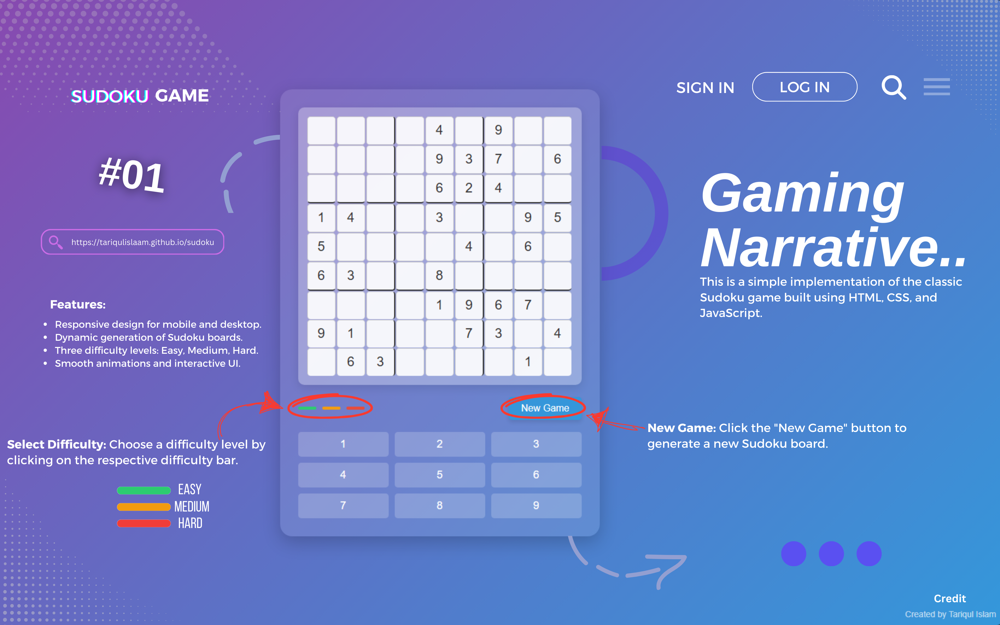

# Sudoku Game

This is a simple implementation of the classic Sudoku game built using HTML, CSS, and JavaScript.

You can play the live demo [here](https://tariqulislaam.github.io/sudoku/).

## Features

- Responsive design for mobile and desktop.
- Dynamic generation of Sudoku boards.
- Three difficulty levels: Easy, Medium, Hard.
- Smooth animations and interactive UI.

## How to Play

1. **Start the Game:** Click on the live demo link above.
2. **New Game:** Click the "New Game" button to generate a new Sudoku board.
3. **Select Difficulty:** Choose a difficulty level by clicking on the respective difficulty bar (Easy, Medium, Hard).
4. **Fill the Board:** Click on any cell to start filling numbers. Click multiple times to cycle through numbers 1 to 9.
5. **Highlighting:** Hover over a cell to see a slight highlighting effect.
6. **Restart:** Click the "New Game" button again to reset the board and start over.

## Credits

- Original game concept and design: **[Tariqul Islam](https://facebook.com/tariqulislaamrahat)**

## Update

- Keyboard Added.
- Fixed some bugs and issues.
- Added more bugs to fix later.

## License

This project is licensed under the MIT License - see the [LICENSE](LICENSE) file for details.
